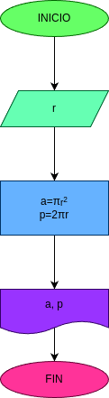

# Programa 1: area_perimetro_circulo
Programam en Phython para Calcular el Area y el Perimetro de un Circulo, dado el valor de su radio.

# Análisis

### Variable de entrada
- r: Radio de Circulo

### Procesamiento
- a : Area de Circulo
- p : Perimetro del Circulo

$a = \pi*r²$

$p = 2*\pi*r$

## Diseño

## Construccion

- Codigo implementado en el archivo "area_perimeter_circle.py"
